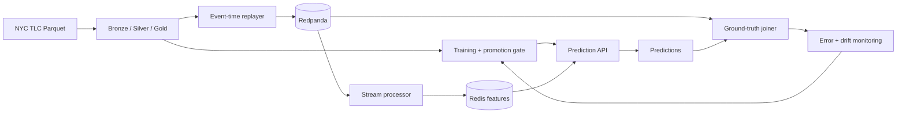

# Real-Time ML Platform

A local-first, production-shaped machine learning platform built on New York City taxi trip
data. It is designed to demonstrate the data-intensive side of senior AI engineering:
point-in-time-correct features, event-time stream processing, training/serving parity, guarded
model promotion, low-latency serving, closed-loop monitoring, and reproducible operations on
Kubernetes.

> **Status:** local infrastructure milestone. The package, configuration system, versioned event
> contracts, CI quality gates, kind cluster, and stateful platform dependencies are implemented.
> Batch ingestion is the next milestone.

## Intended architecture



The complete design, delivery phases, service objectives, and acceptance criteria are in the
[architecture plan](arch_plan/realtime-ml-platform-plan.md).

## Quick start

Requires Python 3.12.

```bash
python3.12 -m venv .venv
source .venv/bin/activate
python -m pip install -e '.[dev]'
make check
```

Validate the platform configuration and inspect its deterministic fingerprint:

```bash
tripml config validate
```

Export the versioned contracts that will be registered with the Redpanda schema registry:

```bash
tripml contracts export --output build/contracts
```

Environment variables override YAML values using `TRIPML_` and double underscores for nested
fields. For example:

```bash
TRIPML_SERVING__P95_LATENCY_OBJECTIVE_MS=75 tripml config validate
```

## Local infrastructure

Docker and `kubectl` are the only global prerequisites. The repository downloads checksum-
verified, pinned kind and Helm binaries into the ignored `.tools/` directory.

```bash
make helm-lint       # render and validate the chart without a cluster
make cluster         # create kind and install the infrastructure
make cluster-test    # rerun database, cache, object-store, and broker smoke tests
make cluster-status # inspect workloads, PVCs, and service endpoints
make cluster-delete # remove the cluster and its local data
```

The local chart currently provisions single-node Redpanda, PostgreSQL, Redis, and MinIO with
health probes, resource requests and limits, persistent volumes, and credentials generated at
cluster creation. Secrets are never written to the repository or Helm values. MinIO is pinned to
its final official community image because upstream moved to source-only distribution; that
trade-off is intentionally limited to the zero-cost local profile.

The packaging rationale and production boundary are recorded in
[ADR-0001](docs/adr/0001-local-infrastructure-packaging.md).

## Engineering principles

- Event and table boundaries have explicit, versioned contracts.
- Event time—not arrival time—drives streaming windows.
- Offline features are point-in-time correct and tested against online features.
- A candidate model must pass declared quality and latency gates before promotion.
- Failure recovery and observability are product behavior, not follow-up work.
- Every portfolio claim will link to reproducible evidence from a showcase run.
