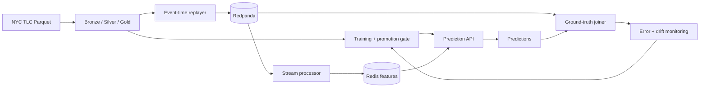

# Real-Time ML Platform

A local-first, production-shaped machine learning platform built on New York City taxi trip
data. It is designed to demonstrate the data-intensive side of senior AI engineering:
point-in-time-correct features, event-time stream processing, training/serving parity, guarded
model promotion, low-latency serving, closed-loop monitoring, and reproducible operations on
Kubernetes.

> **Status:** foundation milestone. The package, configuration system, versioned event
> contracts, JSON Schema export, test suite, and CI quality gates are implemented. Batch and
> streaming services are the next milestones.

## Intended architecture



The complete design, delivery phases, service objectives, and acceptance criteria are in the
[architecture plan](arch_plan/realtime-ml-platform-plan.md).

## Quick start

Requires Python 3.12.

```bash
python3.12 -m venv .venv
source .venv/bin/activate
python -m pip install -e '.[dev]'
make check
```

Validate the platform configuration and inspect its deterministic fingerprint:

```bash
tripml config validate
```

Export the versioned contracts that will be registered with the Redpanda schema registry:

```bash
tripml contracts export --output build/contracts
```

Environment variables override YAML values using `TRIPML_` and double underscores for nested
fields. For example:

```bash
TRIPML_SERVING__P95_LATENCY_OBJECTIVE_MS=75 tripml config validate
```

## Engineering principles

- Event and table boundaries have explicit, versioned contracts.
- Event time—not arrival time—drives streaming windows.
- Offline features are point-in-time correct and tested against online features.
- A candidate model must pass declared quality and latency gates before promotion.
- Failure recovery and observability are product behavior, not follow-up work.
- Every portfolio claim will link to reproducible evidence from a showcase run.

