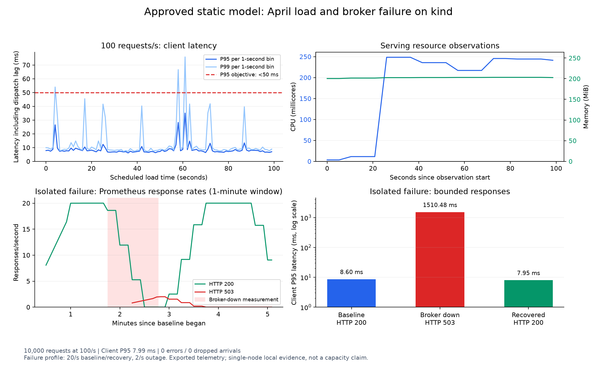
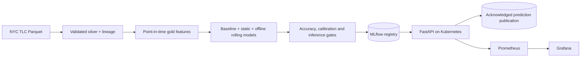

# Real-Time ML Platform

A reproducible NYC taxi-trip duration system: public Parquet data becomes validated features,
evaluated LightGBM models, and predictions served through FastAPI on Kubernetes. The project
demonstrates data contracts, leakage controls, guarded model promotion, and measured failure
behavior. The delivered portfolio scope is **batch training and online prediction serving**.

**Start here:** [five-minute walkthrough](docs/portfolio-walkthrough.md) ·
[clean-checkout reproduction](docs/runbooks/reproduce-release.md) ·
[release notes](docs/releases/v0.1.0.md) · [operations guide](docs/platform-guide.md)

## Measured results

| Result | Evidence and scope |
|---|---|
| **187.18 s MAE**, **25.78% below baseline** | [9.32M January–March training / 3.42M April holdout trips](docs/validation/batch-release-model.md); fixed accuracy, calibration and inference gates passed |
| **10,000 successes at 100 requests/s**, **7.99 ms client P95** | [Single-node kind load](docs/validation/approved-model-operations.md); broker acknowledgment enabled, zero errors or dropped arrivals, 10,020 measured/warm-up events independently matched |
| **120 explicit HTTP 503s**, recovery in **6.25 s** | [Isolated broker failure](docs/validation/approved-model-operations.md#isolated-broker-failure-and-recovery); unchanged API process, lower-rate fault profile, all 4,040 acknowledged baseline/recovery events matched |
| **3/3 April count cohorts matched native inference** | [Approved Kubernetes deployment](docs/validation/approved-model-deployment.md); known, zero and unknown passenger counts, exact model and broker-event provenance |

All results identify bundle `98ef1dd9ef4447f7-static`. The [model card](docs/validation/batch-release-model-card.md)
records cohort errors and feature assumptions. These are local measurements, not production capacity
or a live pre-trip ETA validation. TLC distance is observed completed-trip distance.



## Implemented architecture



Airflow orchestrates ingestion, feature generation and training. PostgreSQL retains lineage and
registry metadata; MinIO stores cluster model artifacts. Helm packages the local kind platform.
The selected static model bypasses Redis. Rolling-feature training and Redis serving support exist,
but a live feature producer, event replay and offline/online parity remain future work.

## Reproduce and review

Requires Python 3.12; macOS also needs `brew install libomp`. From a fresh checkout:

```bash
python3.12 -m venv .venv
source .venv/bin/activate
python -m pip install -c requirements/portfolio-python312.txt -e '.[dev]'
make check PYTHON=.venv/bin/python
```

The [reproduction runbook](docs/runbooks/reproduce-release.md) covers the checksummed artifact
archive, a three-cohort prediction smoke, an interactive API, and the full data rebuild path.
The [clean-checkout receipt](docs/validation/clean-checkout.md) states exactly what was rerun.
The archive is prepared locally; GitHub release publication is pending the maintainer's commit
and release commands. No hosted download is claimed before that publication.

## Engineering decisions

- **Correctness before publication:** atomic ingestion, named quality checks, quarantine, source
  hashes and completion-time feature windows prevent partial data and target leakage.
- **Promotion is explicit:** baseline, static and offline rolling candidates share a holdout;
  every gate must pass, artifact integrity is checked, and retries preserve registry identity.
- **Failure is observable:** HTTP success waits for broker acknowledgment. Broker failure returns
  a bounded 503 with delivery uncertainty; this is not an exactly-once claim.
- **Evidence is scoped:** client latency includes dispatch lag and acknowledgment. Raw samples,
  failed phases, monitoring exports, resource observations and model identities are retained.

See [18 architecture decisions](docs/adr/), the [data card](docs/data-card.md),
[deployment runbook](docs/runbooks/deploy-approved-model.md), and
[load/failure runbook](docs/runbooks/release-operations.md).

## Limits and next work

The median baseline lacks distance and passenger count; a distance-aware baseline or ablation
would strengthen the modeling comparison. April has already been observed, so further tuning needs
a fresh validation design. One laptop, one kind node and one declared load run do not establish
high availability or maximum throughput. The fault suite ran below the main 100 requests/s profile.

Next: event replay and live event-time features, measured offline/online parity, prediction/completion
joins, drift-triggered retraining, and request-rate autoscaling. These are tracked separately in the
[portfolio checklist](docs/portfolio-completion.md) and [full architecture plan](arch_plan/realtime-ml-platform-plan.md).

MIT licensed. NYC TLC data attribution and limitations are in the [data card](docs/data-card.md).
