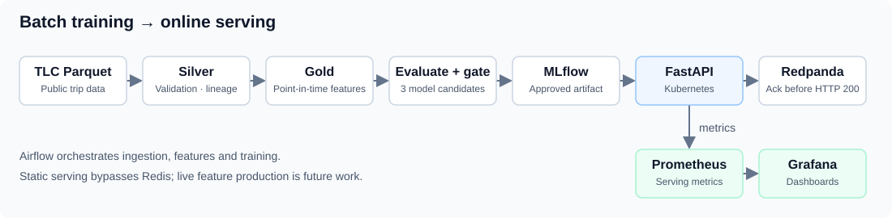

# Real-Time ML Platform

NYC taxi-duration prediction with validated data, point-in-time features, guarded model promotion,
and FastAPI serving on Kubernetes. Delivered scope: **batch training and online prediction serving**.

[Five-minute walkthrough](docs/portfolio-walkthrough.md) ·
[Reproduce the release](docs/runbooks/reproduce-release.md) ·
[Operations guide](docs/platform-guide.md)

## Measured results

| Result | Evidence |
|---|---|
| **187.18 s MAE**, **25.78% below baseline** | [9.32M training / 3.42M April holdout trips; fixed gates passed](docs/validation/batch-release-model.md) |
| **100 requests/s**, **7.99 ms client P95** | [10,000 successes on local kind; broker acknowledgment enabled; zero errors/drops](docs/validation/approved-model-operations.md) |
| **6.25 s broker recovery** | [120 explicit HTTP 503s during an isolated outage; recovery without restarting the API](docs/validation/approved-model-operations.md#isolated-broker-failure-and-recovery) |

<a id="implemented-architecture"></a>

## Implemented batch-serving path



[Open the architecture diagram](docs/architecture.svg). Airflow orchestrates batch work.
The approved static model bypasses Redis; HTTP success waits for broker acknowledgment.
See the [architecture decisions](docs/adr/) for trade-offs.

## Quick start

Python 3.12 required; on macOS, first install OpenMP with `brew install libomp`.

```bash
python3.12 -m venv .venv
source .venv/bin/activate
python -m pip install -c requirements/portfolio-python312.txt -e '.[dev]'
make check PYTHON=.venv/bin/python
```

[Fresh-environment verification](docs/validation/clean-checkout.md): **331 tests passed**,
**6 optional service tests skipped**, **94.89% coverage**. The
[reproduction runbook](docs/runbooks/reproduce-release.md) covers the packaged model demo and full
data rebuild. Artifacts are prepared locally; publication remains a maintainer step.

## Scope and limitations

TLC distance is observed completed-trip distance, so this is not a validated pre-trip ETA.
The median baseline lacks distance/passenger inputs. Load results are from one local kind node;
the fault suite used lower-rate traffic. These measurements do not establish production capacity,
high availability or exactly-once delivery. See the [model card](docs/validation/batch-release-model-card.md).

Live feature production, offline/online parity, completion joins and drift-triggered retraining
remain [future work](docs/portfolio-completion.md). [Data attribution](docs/data-card.md) · [MIT license](LICENSE).
