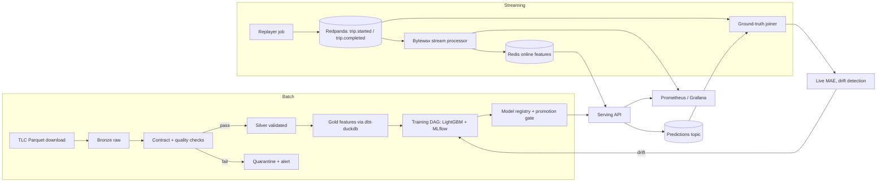

# Real-Time ML & Data Platform

## 1. Executive summary

This document defines a real-time machine learning platform built on public New York City Taxi and Limousine Commission (TLC) trip records. The system ingests historical trips in batch, replays them as a live event stream at controllable speed, computes features in both batch and streaming paths, trains and registers a trip-duration model, serves predictions with online features at low latency, joins predictions to ground truth as trips complete, detects drift, and triggers retraining. Every stage has data contracts, quality gates, recoverable failure handling, and telemetry.

The platform runs entirely on a local Kubernetes cluster (kind) with zero cloud spend. Its output is not a running service but a set of **showcase runs**: scripted, reproducible executions of the full scenario that export dashboards, metrics, model comparisons, lineage, and failure-injection evidence into a committed folder. A reviewer sees the evidence in the repository and can reproduce any run on a laptop with one command.

This is the third portfolio project. `deep-research` demonstrates agentic systems on AWS; `rag-eval-platform` demonstrates LLM evaluation and observability. This project demonstrates the data-intensive, backend-heavy half of the senior AI engineer profile: streaming and batch pipelines, feature consistency, training and registry, serving, monitoring, retraining, and Kubernetes operations. No large language model is involved; that is deliberate.

### Goals

- Ingest monthly TLC Parquet files through bronze, silver, and gold layers with schema contracts, quality checks, and quarantine of failing partitions.
- Replay trips as pickup and completion events through a Kafka-compatible broker and compute windowed zone-level features in a stream processor with recovery from offsets.
- Compute the same features in batch for training with point-in-time correctness, and prove batch and stream parity with an automated skew test.
- Train a gradient-boosted trip-duration model, track experiments, register versions, and promote only when a candidate beats both a naive baseline and the current production model by a declared margin.
- Serve predictions with online features under a stated latency objective, log every prediction, and compute live error once ground truth arrives.
- Detect feature and target drift, alert, and trigger the retraining pipeline automatically.
- Deploy every component to Kubernetes with Helm, health probes, resource limits, and autoscaling for the serving tier.
- Produce a showcase-run harness that executes the scenario, injects failures, and exports evidence artifacts for the README.

### Non-goals for the first release

- Cloud deployment. An EKS path is discussed as an optional appendix with a per-session cost estimate but is not part of the deliverable.
- A managed feature store such as Feast; offline and online stores are explicit tables with parity tests, and the trade-off is recorded as a decision.
- Deep learning or time-series foundation models; the model is a gradient-boosted tree with a naive baseline.
- Multi-tenant access control; a single operator identity is assumed on a private cluster.
- Ingesting live TLC data; TLC publishes historical files, so real time is simulated by replay with event-time semantics.
- A web front end beyond Grafana, MLflow, and Airflow's own interfaces.

## 2. User experience and workflow

The users are an engineer running the platform and a reviewer reading the evidence.



### Engineer workflow

1. `make cluster` creates a kind cluster and installs the platform chart: Redpanda, Postgres, Redis, MinIO, Airflow, MLflow, Prometheus, Grafana, the stream processor, the serving API, and the ground-truth joiner.
2. `make ingest MONTHS=2024-01,2024-02,2024-03` triggers the Airflow ingestion DAG, which downloads, validates, and builds bronze, silver, and gold layers in MinIO.
3. `make train` triggers the training DAG; MLflow records the run and the promotion gate registers the model if it passes.
4. `make replay MONTH=2024-04 DAY=15 SPEED=60` starts the replayer, which publishes one hour of trips per minute; features flow to Redis and the API begins serving with live features.
5. `make showcase` runs steps 1 through 4 plus the failure-injection scenarios, exports evidence to `showcase/<timestamp>/`, and destroys the cluster.

### Reviewer workflow

A reviewer opens `showcase/latest/README.md`, which the harness generates: the model comparison table, the feature-freshness and serving-latency percentiles, the live error curve, the drift report, and a table of injected failures with recovery times. Each number links to the raw export that produced it. The reviewer can run `make showcase` to regenerate everything.

### Showcase run lifecycle

```text
PROVISIONING     (kind cluster, Helm release, readiness)
  -> INGESTING   (batch months through bronze/silver/gold)
  -> TRAINING    (baseline, candidate, gate, registration)
  -> REPLAYING   (event stream, online features, live serving)
  -> INJECTING   (failure scenarios, one at a time, with recovery assertions)
  -> EXPORTING   (dashboards, metrics, reports, logs)
  -> TEARDOWN
```

`FAILED` at any stage keeps the cluster alive for inspection and writes a partial export with the failure recorded. The harness is idempotent per stage so a failed run resumes from the last completed stage.

## 3. System architecture

### 3.1 Components

| Component | Implementation | Kubernetes shape | Responsibility |
|---|---|---|---|
| Object storage | MinIO | StatefulSet, persistent volume | Bronze, silver, gold Parquet layers; MLflow artifacts; exports |
| Relational store | Postgres 16 | StatefulSet | Airflow metadata, MLflow backend, prediction log, ground-truth joins, quality-check results |
| Message broker | Redpanda (Kafka API) with built-in schema registry | StatefulSet, 1 broker locally | `trip.started`, `trip.completed`, `predictions`, `ground_truth`, `quarantine` topics |
| Online feature store | Redis | Deployment | Windowed zone-level features keyed by zone and window |
| Batch orchestration | Apache Airflow, LocalExecutor | Official Helm chart, scheduler + webserver | Ingestion, quality, dbt, training, drift-check, retraining DAGs |
| Transformations | dbt with dbt-duckdb reading Parquet from MinIO | Runs inside Airflow tasks | Silver to gold models with dbt tests |
| Stream processor | Bytewax | Deployment with recovery store on a persistent volume | Windowed aggregates per zone, late-event handling, writes to Redis, emits feature-freshness metrics |
| Replayer | Python job | Kubernetes Job | Publishes historical trips as event-time ordered events at a configurable speed factor |
| Serving API | FastAPI with LightGBM | Deployment, HorizontalPodAutoscaler, readiness gates on model load | `POST /v1/eta` with online feature lookup; prediction logging |
| Ground-truth joiner | Python consumer | Deployment | Joins predictions to completion events, writes error records, exposes live MAE |
| Drift monitor | Evidently inside an Airflow DAG | Scheduled DAG | Feature and target drift reports; triggers retraining DAG |
| Experiment tracking and registry | MLflow | Deployment | Runs, metrics, artifacts, model versions, stage transitions |
| Telemetry | Prometheus, Grafana, Alertmanager via kube-prometheus-stack | Helm dependency | Metrics, provisioned dashboards, alert rules |
| Showcase harness | Python CLI `tripml showcase` | Runs from the laptop | Orchestrates stages, injects failures, exports evidence |

### 3.2 Data layers and contracts

- **Bronze** holds TLC Parquet files exactly as downloaded, partitioned by month, with the download checksum recorded.
- **Silver** holds rows that pass the trip contract: pickup before dropoff, duration between 1 minute and 3 hours, distance between 0 and 100 miles, known pickup and dropoff zone identifiers, non-negative fare, timestamps inside the file's month. Violations are counted by rule; a partition whose violation rate exceeds a threshold is quarantined and the DAG fails loudly rather than silently dropping rows.
- **Gold** holds dbt models: a cleaned trips table, a zone-hour aggregate table, and the training feature table with point-in-time windowed features computed from the trips that completed before each pickup.
- Contracts are Pydantic models for events and pandera schemas for tabular data. The same Pydantic event model is registered as a JSON Schema in the Redpanda schema registry so the replayer, stream processor, and joiner cannot disagree about event shape.
- Every silver and gold partition records the contract version, dbt model version, row counts, and check results in Postgres so lineage is queryable.

### 3.3 Streaming path

- The replayer reads a chosen day from silver, sorts by event time, and emits `trip.started` at pickup time and `trip.completed` at dropoff time, compressing wall-clock time by the speed factor. Events carry event-time timestamps; the processor never uses arrival time for windows.
- Bytewax consumes `trip.started` and `trip.completed` with a consumer group, keys by pickup zone, and maintains sliding windows of 15 and 60 minutes over completed trips: trip count, mean duration, mean speed, and mean distance. Windows close on watermarks with a configurable allowed lateness; late events after the watermark increment a `late_events_dropped` counter instead of corrupting closed windows.
- Closed window results are written to Redis under a versioned key schema with a time-to-live, and a feature-freshness gauge records event time to Redis write latency.
- Bytewax recovery state is persisted so a crashed processor resumes from its last checkpoint without recomputing from the start of the topic, and duplicate window emissions are made idempotent by keying Redis writes on window end time.

### 3.4 Batch path and feature parity

- The training feature table computes the same 15 and 60 minute zone features from silver using DuckDB window functions over completed trips strictly before each pickup timestamp. This is the point-in-time join that prevents leakage.
- A parity test replays one day through the stream processor, then computes the batch features for the same day, and compares per zone and window. Mismatch rate and maximum absolute difference are reported; a threshold breach fails the showcase run. This test is the platform's answer to training-serving skew.

### 3.5 Model lifecycle

- Target: trip duration in seconds at pickup time.
- Baseline: median duration by pickup zone, dropoff zone, and hour of week, computed from the training period. The baseline is served through the same API path so its latency and error are measured identically.
- Candidate: LightGBM on static features (zones, hour of week, distance, passenger count) plus the streaming zone features. A second candidate trained without streaming features quantifies their contribution, which becomes the headline result.
- Training runs are MLflow experiments with parameters, metrics (MAE, RMSE, MAPE, and error by distance bucket), feature importance, the data partitions used, the dbt model versions, and the git commit.
- The promotion gate requires the candidate to beat the baseline and the current production version on a held-out month by a declared MAE margin, to pass a calibration check across distance buckets, and to have a latency benchmark under objective. Passing registers the version and transitions it to the production alias; the serving API reloads on a rolling restart.
- A model card is generated per registered version.

### 3.6 Serving and closed-loop monitoring

- `POST /v1/eta` accepts pickup zone, dropoff zone, pickup time, distance, and passenger count, reads the zone features from Redis, predicts, and returns the estimate with the model version, feature timestamps, and a prediction identifier.
- A missing or stale online feature falls back to a batch-computed default with an explicit `feature_fallback` flag in the response and a counter in metrics; the API never fails a request because Redis is behind.
- Every prediction is published to the `predictions` topic. The joiner matches predictions to `trip.completed` events, writes error records to Postgres, and exposes live MAE, coverage, and join latency.
- The drift DAG runs on a schedule, compares the recent prediction-time feature distribution and the recent error distribution to the training reference with Evidently, writes an HTML report to MinIO, raises an alert on breach, and triggers the training DAG.

### 3.7 Kubernetes packaging

- One Helm application chart with lightweight templates for the local third-party dependencies and first-party services. Values profiles: `local` (kind, single replicas, reduced memory), `ci` (no Grafana or Airflow web, shortest replay), and `showcase` (full stack). The local dependency packaging and its explicitly non-production boundary are recorded in ADR-0001; a production deployment would use managed services or maintained operators.
- Every first-party service has liveness and readiness probes, resource requests and limits, a PodDisruptionBudget where relevant, and a ServiceMonitor for Prometheus.
- The serving API has a HorizontalPodAutoscaler on CPU and a custom request-rate metric, exercised during the showcase load test.
- Secrets are Kubernetes Secrets generated at install time; no credential is committed.
- Persistent volumes on kind use the default local provisioner; the chart declares storage classes as values so a cloud install changes values only.

## 4. Service responsibilities

All inter-service payloads are Pydantic models serialized to JSON with registered schemas. Airflow tasks call library functions in `src/tripml`; no business logic lives in DAG files.

### 4.1 Ingestion DAG

- Downloads the requested month from the TLC public bucket with checksum recording and skip-if-present.
- Loads the taxi zone lookup table and validates that all zone identifiers resolve.
- Applies the trip contract, writes silver and quarantine outputs, records check results, and fails the DAG on threshold breach.
- Runs dbt models and dbt tests to build gold, and records model versions and row counts.

### 4.2 Training DAG

- Builds the training and holdout feature sets from gold for the declared months.
- Trains the baseline, the candidate without streaming features, and the candidate with streaming features.
- Logs everything to MLflow, runs the promotion gate, registers on pass, writes the model card, and emits a `model_promoted` metric.

### 4.3 Replayer

- Reads one day of silver, emits events in event-time order at the speed factor, and supports a late-event injection rate and an out-of-order window for testing.
- Publishes with idempotent producer settings and records the number of events emitted so downstream counts can be reconciled.

### 4.4 Stream processor

- Owns window definitions, watermark and lateness policy, Redis writes, recovery state, and freshness metrics.
- Exposes consumer lag, window close counts, late-drop counts, and processing latency.

### 4.5 Serving API

- Loads the production model version at startup and on a reload signal; readiness fails until the model is loaded and Redis is reachable.
- Enforces request validation, feature fallback, prediction logging, and structured error responses.
- Exposes latency histograms by stage: feature lookup, inference, and logging.

### 4.6 Ground-truth joiner and drift monitor

- Joins predictions to completions by trip identifier with a bounded wait; unmatched predictions after the bound are counted as `unjoined`.
- Publishes live MAE and coverage; the drift DAG consumes the Postgres error table and feature log.

### 4.7 Showcase harness

- Drives the lifecycle in section 2, waits on readiness and on metric conditions rather than fixed sleeps, injects failures, asserts recovery, exports evidence, and tears down.
- Exports include Grafana panel renders through the Grafana rendering endpoint, Prometheus range queries as CSV, MLflow run comparisons as Markdown, Evidently reports as HTML, Airflow DAG run summaries, parity-test output, and pod event logs for each injected failure.

## 5. Datasets

| Dataset | Source | Size used | Purpose |
|---|---|---|---|
| Yellow taxi trip records, Parquet | NYC TLC trip record data page | Three training months and one holdout month from 2024; roughly 3 million rows per month | Batch ingestion, training, holdout, replay source |
| Taxi zone lookup | NYC TLC | 265 zones | Zone identifier validation and zone features |
| Synthetic anomalies | Generated by the harness | Small | Contract-violation partitions, late events, duplicate events for failure scenarios |

TLC data is public and published by the City of New York. The data card records the source, retrieval date, license terms as stated on the TLC page, known quirks (negative fares, zero-distance trips, timestamps outside the file month), and the exact contract rules applied. Data is downloaded at ingestion and never committed.

## 6. Models and configuration

```yaml
training:
  train_months: ["2024-01", "2024-02", "2024-03"]
  holdout_month: "2024-04"
  target: trip_duration_seconds
  features:
    static: [pu_zone, do_zone, hour_of_week, trip_distance, passenger_count]
    streaming: [pu_zone_trips_15m, pu_zone_mean_speed_15m, pu_zone_mean_duration_60m, do_zone_trips_60m]
  model:
    type: lightgbm
    params: { objective: regression_l1, num_leaves: 63, learning_rate: 0.05, n_estimators: 800 }
    seed: 42
promotion_gate:
  min_mae_improvement_vs_baseline_pct: 15
  min_mae_improvement_vs_production_pct: 1
  max_bucket_calibration_error_pct: 10
  max_inference_p95_ms: 5
streaming:
  windows: { short: 15m, long: 60m }
  allowed_lateness: 5m
  feature_ttl: 2h
serving:
  feature_staleness_limit: 10m
  p95_latency_objective_ms: 50
```

- All thresholds, window sizes, months, and model parameters are configuration, never constants in source.
- Seeds are fixed; training is deterministic given the same gold partitions.
- Model artifacts are stored in MLflow with the feature list, contract version, and dbt versions as tags so a served model can always be traced to its data.

## 7. Public interfaces and data contracts

### 7.1 Serving API

| Method and path | Purpose |
|---|---|
| `POST /v1/eta` | Predict trip duration; returns estimate, model version, feature timestamps, fallback flag, prediction identifier |
| `GET /v1/model` | Current model version, feature list, load time, and gate results |
| `POST /v1/model/reload` | Reload the production alias from the registry (operator only) |
| `GET /healthz`, `GET /readyz` | Liveness; readiness confirms model loaded and Redis reachable |
| `GET /metrics` | Prometheus exposition |

### 7.2 Event and table contracts

- `TripStarted`: trip identifier, event time, pickup zone, dropoff zone, distance, passenger count, schema version.
- `TripCompleted`: trip identifier, event time, actual duration, fare, schema version.
- `Prediction`: prediction identifier, trip identifier, model version, features used, feature timestamps, fallback flag, estimate, served at.
- `GroundTruth`: prediction identifier, actual duration, absolute error, joined at, join latency.
- `ZoneWindowFeatures`: zone, window kind, window end, trip count, mean duration, mean speed, mean distance, computed at.
- `QualityCheckResult`: partition, rule, violations, total rows, threshold, passed, contract version.
- `PromotionDecision`: candidate version, production version, metrics per model, gate rules with pass or fail, decision, decided at.
- `DriftReport`: window, features drifted, statistic per feature, target drift, threshold, action taken.
- `ShowcaseRun`: identifier, git commit, chart version, stages with timings and status, scenario results, export paths.

### 7.3 Service objectives

| Objective | Target | Measured by |
|---|---:|---|
| Batch ingestion of one month on the reference laptop | under 10 minutes | Airflow DAG duration |
| Feature freshness, event time to Redis write, P95 at 60x replay | under 5 seconds | Stream processor gauge |
| Serving latency, P95 including Redis lookup | under 50 ms | API histogram |
| Feature fallback rate during steady replay | under 1 percent | API counter |
| Ground-truth join coverage within the wait bound | over 99 percent | Joiner gauge |
| Processor recovery after pod kill | under 60 seconds to resume, zero duplicate windows | Scenario assertion |
| Drift detection to retraining trigger | within one drift DAG cycle | Airflow run timestamps |

Targets assume an Apple Silicon laptop with at least 16 GB of memory and 10 to 12 GB allocated to the container runtime. They are validated in phase 1 and revised honestly if not met.

## 8. Security and operations

- The cluster is local and private; the API still requires a bearer token for operator endpoints so the pattern is present.
- Kubernetes Secrets are generated at install; MinIO, Postgres, Redis, and Redpanda credentials never appear in values files or the repository.
- Containers run as non-root with read-only root filesystems where the component allows it; images are pinned by digest and scanned with Trivy in CI.
- Network policies restrict the serving API to Redis and the broker, and the stream processor to the broker and Redis.
- Resource limits on every pod prevent one component from starving the laptop cluster.
- Quarantined partitions and failed DAG runs are visible in Airflow and in a Grafana panel; nothing fails silently.
- Runbooks in `docs/runbooks/` cover processor restart, broker offset reset, model rollback to the previous alias, and quarantine review.

## 9. Observability, quality, and operations

### Metrics

- Ingestion: rows per layer, violation counts by rule, quarantine events, DAG durations, dbt test results.
- Streaming: consumer lag, events per second, window closes, late drops, freshness, recovery events, Redis write latency.
- Serving: request rate, error rate, latency by stage, fallback rate, model version label, HPA replica count.
- Model: live MAE and coverage, error by distance bucket, drift statistics, promotion decisions, retraining triggers.
- Platform: pod restarts, memory and CPU by component, persistent volume usage.

### Dashboards

Grafana dashboards are provisioned from JSON: a pipeline dashboard (batch health and quality), a streaming dashboard (lag, freshness, recovery), a serving dashboard (traffic, latency, fallbacks, replicas), and a model dashboard (live error, drift, promotions). The showcase harness renders each panel to PNG for the evidence folder.

### Alerts

- Freshness above objective for two minutes.
- Consumer lag growing for five minutes.
- Serving P95 above objective or fallback rate above threshold.
- Live MAE above the promotion-time holdout MAE by a margin.
- Drift detected.
- Quarantine event or DAG failure.

Alertmanager routes to a log sink locally; the alert firing history is part of the evidence export.

### Showcase scenarios

Each scenario has a setup, an injected failure, an assertion, and an exported artifact.

| Scenario | Injection | Assertion |
|---|---|---|
| Processor crash | Delete the stream processor pod mid-replay | Resumes within objective; window counts reconcile; no duplicate Redis windows |
| Broker restart | Restart the Redpanda pod | Producer and consumers reconnect; event counts reconcile end to end |
| Late and out-of-order events | Replayer emits 5 percent of events late beyond allowed lateness | Late-drop counter matches injected count; closed windows unchanged |
| Bad partition | Ingest a synthetic month with 20 percent contract violations | Partition quarantined; DAG fails; alert fires; silver unchanged |
| Redis outage | Scale Redis to zero during serving | Fallback flag rises to 100 percent; API error rate stays at zero; recovers when Redis returns |
| Weak candidate | Train with streaming features removed and a poor learning rate | Promotion gate rejects; production version unchanged |
| Drift | Replay a holiday day with unusual demand | Drift DAG flags target drift; retraining DAG triggered |
| Load | Drive the API at rising request rate with k6 | HPA scales out; P95 stays under objective until the declared saturation point |

## 10. Implementation plan

1. Establish the repository: `pyproject.toml`, `src/tripml` package, Ruff, mypy, pytest markers, pre-commit, Makefile, and the test workflow.
2. Define Pydantic event models, pandera table schemas, configuration loading, and the schema registry registration utility.
3. Build the kind cluster bootstrap and the umbrella Helm chart with third-party subcharts and the `local` values profile; confirm the stack fits the memory budget.
4. Implement batch ingestion: download, bronze, contract checks, quarantine, silver, lineage records; wire as the Airflow ingestion DAG.
5. Implement dbt-duckdb models and tests for gold, including the point-in-time training feature table.
6. Implement training: baseline, both candidates, MLflow tracking, promotion gate, registration, model card; wire as the training DAG.
7. Implement the serving API with model loading, Redis lookup, fallback, prediction logging, and metrics; deploy with probes and HPA.
8. Implement the replayer and the Bytewax processor with windows, lateness, recovery, Redis writes, and metrics.
9. Implement the batch and stream parity test.
10. Implement the ground-truth joiner, live error metrics, the drift DAG with Evidently, and the retraining trigger.
11. Provision Grafana dashboards and alert rules; add the `ci` values profile and the kind-based end-to-end workflow.
12. Build the showcase harness: stages, readiness waits, scenarios, exports, generated README, teardown.
13. Write the README following the portfolio template with headline results, architecture diagram, evidence links, runbooks, ADRs, model card, and data card; tag a release.

## 11. Level of effort

### Sizing definitions

- **S:** 1–2 engineer-days
- **M:** 3–5 engineer-days
- **L:** 6–9 engineer-days
- **XL:** 10–14 engineer-days

Estimates assume one engineer with the FastAPI, Postgres, Docker, and CI experience from the previous two projects but new to Airflow, Bytewax, Helm, and kind.

| Workstream | Size | Engineer-days | Dependencies |
|---|---:|---:|---|
| Repository foundation, contracts, configuration, test workflow | M | 3–4 | None |
| kind bootstrap and umbrella Helm chart with third-party subcharts | L | 6–8 | Foundation |
| Batch ingestion, quality checks, quarantine, lineage, ingestion DAG | M | 4–5 | Chart |
| dbt-duckdb gold models, tests, point-in-time feature table | M | 3–4 | Ingestion |
| Training, MLflow, promotion gate, registry, model card, training DAG | M | 4–5 | Gold |
| Serving API, probes, HPA, prediction logging | M | 3–4 | Registry |
| Replayer and Bytewax processor with recovery and metrics | L | 6–8 | Chart |
| Batch and stream parity test | S | 2 | Processor, gold |
| Ground-truth joiner, live error, drift DAG, retraining trigger | M | 4–5 | Serving, processor |
| Dashboards, alerts, `ci` profile, kind end-to-end workflow | M | 3–4 | All services |
| Showcase harness, scenarios, evidence export | L | 6–8 | Everything above |
| README, ADRs, runbooks, model and data cards, release | M | 3–4 | Showcase |
| **Total** |  | **47–61** |  |

### Calendar interpretation

- Full-time: approximately 9–12 weeks.
- Part-time at roughly half capacity: approximately 5–6 months.
- Phase 1 (batch ingestion, gold, training with gate, serving on kind, first dashboards): approximately 23–30 engineer-days and already publishable with a model comparison table and Kubernetes deployment.

The research report's four-week estimate corresponds to phase 1 plus a basic streaming path, not the full closed loop with parity testing and failure-injection evidence.

### Suggested sequencing for a solo engineer

Chart first, so every later component is deployed from day one rather than ported at the end. Batch path and training next because they produce the first publishable result. Streaming, parity, and the closed loop follow. The showcase harness is built incrementally: each scenario is added when its component lands, so the final integration step is small.

## 12. Test and acceptance plan

### Unit and component tests

- Contract rules on hand-built rows: each rule passes and fails as specified; threshold logic quarantines correctly.
- Window aggregation in the processor against a fixed event sequence, including out-of-order and late events, with expected closed windows.
- Point-in-time feature computation on a tiny synthetic trip set with known answers, including the leakage case where a trip completing after pickup must be excluded.
- Promotion gate on synthetic metric sets: pass, fail on baseline margin, fail on production margin, fail on calibration, fail on latency.
- Serving fallback logic, staleness detection, and response schema.
- Joiner matching, bounded wait, and unjoined accounting.
- Harness stage idempotency and resume.

### Integration tests

- Testcontainers for Postgres, Redis, and Redpanda: publish a fixture day through the replayer, run the processor, and assert Redis contents and freshness metrics.
- Airflow DAG integrity tests: every DAG parses, has no cycles, and references only existing library functions.
- dbt tests run against a fixture silver partition.
- MLflow round trip: train on a fixture, register, reload in the API, predict.

### End-to-end tests

- On every pull request: unit and integration suites.
- Nightly and on demand: kind cluster with the `ci` profile, one fixture month, training, a five-minute replay, and assertions on freshness, serving latency, join coverage, and parity mismatch rate.

### Load and performance tests

- k6 against the serving API at fixed and rising rates; results are part of the showcase export.

### Security and hygiene tests

- Trivy image scan and dependency audit in CI.
- A test asserts no secret values appear in rendered Helm templates or exported evidence.

### Acceptance criteria

- Three months ingest to gold with recorded quality results, and a synthetic bad month is quarantined with a failed DAG and a fired alert.
- The training DAG produces baseline and both candidates in MLflow; the candidate with streaming features beats the baseline by at least the declared margin on the holdout month, and the contribution of streaming features is reported with its own number.
- The parity test reports mismatch rate and maximum difference under threshold for a full replayed day.
- Feature freshness, serving latency, fallback rate, and join coverage meet or are honestly reported against the objectives in section 7.3.
- All eight showcase scenarios pass their assertions and produce evidence artifacts.
- `make showcase` on a clean laptop produces a complete `showcase/<timestamp>/` folder and generated README with no manual steps, then leaves no cluster running.
- Every served prediction is traceable to a model version, feature timestamps, contract version, and dbt model versions.

## 13. Rollout plan

### Phase 1: Batch platform on Kubernetes

Chart, ingestion with quality gates, gold with dbt, training with the promotion gate, serving API, and the pipeline and model dashboards. Publishable with the model comparison table and the bad-partition scenario.

### Phase 2: Streaming and parity

Replayer, Bytewax processor, Redis features, streaming dashboard, parity test, and the processor-crash, broker-restart, late-event, and Redis-outage scenarios. The headline "streaming features reduce error by X" result lands here.

### Phase 3: Closed loop

Joiner, live error, drift DAG, retraining trigger, weak-candidate and drift scenarios, load test with HPA.

### Phase 4: Showcase and packaging

Harness completion, evidence export, generated README, ADRs, runbooks, model and data cards, tagged release. Optional appendix: an EKS values profile and Terraform module for an ephemeral cloud run, documented with its per-session cost, and explicitly not required for any claim in the README.

## 14. Assumptions and decisions

- Python 3.12 or later, FastAPI, Pydantic v2, pandera, LightGBM, MLflow, Apache Airflow with LocalExecutor, dbt-duckdb, Bytewax, Redpanda, Redis, MinIO, Postgres, kube-prometheus-stack, Helm, kind.
- No cloud resources are used. Every claim in the README is produced on a laptop kind cluster by the showcase harness. An ephemeral EKS run is optional and out of scope for v1.
- Real time is simulated by replaying historical TLC data with event-time semantics; the README states this plainly.
- Redpanda is chosen over Apache Kafka for a single-binary, lower-memory local footprint while keeping the Kafka API, so producers and consumers are unchanged for a Kafka deployment.
- Bytewax is chosen over Flink or Kafka Streams to keep the processor in Python with real windowing and recovery; the trade-off is recorded as a decision with Flink as the scale-up path.
- Airflow uses LocalExecutor to fit the laptop memory budget; the KubernetesExecutor is a values change.
- A managed feature store is not used; offline and online features are explicit tables with a parity test, and the decision record names Feast as the option if feature count grows.
- Trip duration was chosen as the target because streaming congestion features have a plausible causal effect on it, which makes the contribution of the streaming path measurable rather than decorative.
- The reference laptop has at least 16 GB of memory with 10 to 12 GB allocated to the container runtime; the `local` profile is tuned to that budget and the README states the requirement.
- Repository name `realtime-ml-platform` and package name `tripml` are placeholders to confirm.

## 15. Primary references

- [NYC TLC trip record data](https://www.nyc.gov/site/tlc/about/tlc-trip-record-data.page)
- [Redpanda documentation](https://docs.redpanda.com/)
- [Bytewax documentation](https://docs.bytewax.io/)
- [Apache Airflow Helm chart](https://airflow.apache.org/docs/helm-chart/stable/index.html)
- [dbt-duckdb adapter](https://github.com/duckdb/dbt-duckdb)
- [pandera](https://pandera.readthedocs.io/)
- [LightGBM](https://lightgbm.readthedocs.io/)
- [MLflow model registry](https://mlflow.org/docs/latest/model-registry.html)
- [Evidently](https://docs.evidentlyai.com/)
- [kind](https://kind.sigs.k8s.io/)
- [kube-prometheus-stack chart](https://github.com/prometheus-community/helm-charts/tree/main/charts/kube-prometheus-stack)
- [Grafana provisioning](https://grafana.com/docs/grafana/latest/administration/provisioning/)
- [Helm documentation](https://helm.sh/docs/)
- [k6](https://k6.io/docs/)
