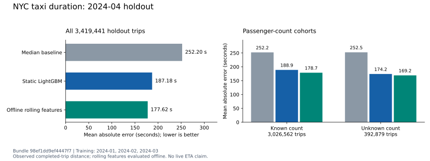

# Full batch-model evaluation — 2026-09-18

The static LightGBM model passed all fixed promotion gates on the full April 2024 holdout:
**187.18 seconds MAE**, a **25.78% reduction** from the hierarchical median baseline's **252.20
seconds**. The approved model was published as version **1** of the isolated
`tripml-trip-duration-static-v2` registry and passed registry-to-API validation.

Training used all **9,316,058** accepted January–March trips; evaluation used all **3,419,441**
accepted April trips. Both candidates used the predeclared 800 trees, 63 leaves, learning rate
0.05, L1 regression objective and seed 42. No rows were subsampled for accuracy evaluation, and
no parameters or gates were changed after seeing April results. Bundle: `98ef1dd9ef4447f7`.

See the [machine-readable evidence](batch-release-model.json), the byte-identical generated
[model card](batch-release-model-card.md), the [configuration](../../examples/training/batch-release.yaml),
and the [reproduction runbook](../runbooks/nullable-passenger-release.md).

## Model comparison and decision

| Model | MAE (s) | RMSE (s) | MAPE (%) | MAE reduction vs baseline | Worst bucket calibration error | Local inference P95 (ms) |
|---|---:|---:|---:|---:|---:|---:|
| Hierarchical median | 252.20 | 447.89 | 29.74 | — | 14.24% | 0.105 |
| Static LightGBM | 187.18 | 328.04 | 19.83 | 25.78% | 9.11% | 0.279 |
| Offline rolling-feature LightGBM | 177.62 | 309.12 | 19.64 | 29.57% | 6.22% | 0.462 |

The selected static candidate met the unchanged gates: MAE reduction at least **15%**, worst
bucket calibration error at most **10%**, and local inference P95 at most **5 ms**. This was the
first version in the isolated registry, so no incumbent comparison applied. All three model runs
were logged; only the selected static candidate was registered and assigned the production alias.

The rolling-feature candidate reduced MAE by a further **9.56 seconds (5.11%)** relative to static.
That result uses historical features computed offline; a live producer and parity checks are still
required before claiming a streaming benefit. The static registry loads only its authorized native
model and deliberately bypasses Redis.

The baseline uses hierarchical pickup-zone, dropoff-zone and hour-of-week medians. Unlike the
LightGBM candidates, it does not use trip distance or passenger count. This is a comparison against
that explicit baseline, not a claim of state-of-the-art ETA accuracy.

## Missingness and distance diagnostics

| Passenger-count cohort | April trips | Baseline MAE (s) | Static MAE (s) | Offline rolling MAE (s) |
|---|---:|---:|---:|---:|
| Known, including observed zero | 3,026,562 | 252.16 | 188.87 | 178.71 |
| Unknown | 392,879 | 252.48 | 174.17 | 169.19 |

Unknown counts remain null under contract 1.1 / `gold-features-v2`; zero is not an imputation.
There are **727,015** unknown counts in training (7.80%) and **392,879** in April (11.49%). Both
cohorts improve against their own baseline scores. Their differing errors are descriptive: they
do not establish a causal missingness effect, equal difficulty or subgroup fairness. These cohort
metrics were predeclared diagnostics, not extra gates tuned on April.

| Distance, lower bound inclusive | April trips | Static MAE (s) | Calibration error |
|---|---:|---:|---:|
| Below 2 miles | 1,857,951 | 126.46 | 9.11% |
| 2–5 miles | 980,175 | 195.75 | 6.88% |
| 5–10 miles | 312,447 | 296.63 | 7.21% |
| At least 10 miles | 268,868 | 448.34 | 7.85% |

Calibration is the absolute difference between predicted and observed bucket means, divided by
the observed mean. The static model underpredicts all four bucket means. Passing the 10% bound
does not remove that bias or the substantial long-trip errors. The full model card records all
three models' bucket results.

## Registry and API validation

The [release validator](../../scripts/validate-release-model.py) checked the original native bundle,
training configuration, all four gold checksums, and the held-out request workload's source and
checksum before publication. It also rejects a workload pointing to the previous month's lookback
input instead of the holdout population. Publication uses the existing guarded registry workflow.

Three real April requests cover positive known, zero, and unknown passenger counts. Each returned
HTTP 200, schema 1.1, the expected static model version, preserved feature values, and the same
prediction as the native LightGBM artifact. The null request with schema 1.0 returned HTTP 422.
An intentionally unavailable Redis endpoint was configured for the smoke check; static serving
bypassed it. Repeating publication reused registry version 1 without changing the alias.

This check used FastAPI's in-process client and disabled broker publication. Its receipt is kept
before subsequent API assertions, so a later validation failure cannot hide a registry change.

## Local HTTP preflight

The predeclared host-loopback run passed every benchmark gate. One Uvicorn API process served all
10,000 sampled April requests at 100 arrivals/second, including **1,178 unknown passenger counts**.
HTTP keep-alive was enabled, concurrency was bounded at 32, and 20 successful warm-up requests were
excluded from measurements. Training and the other compute-heavy checks had finished before load.

| Measurement | Result |
|---|---:|
| Offered rate / measured duration | 100 requests/s / 100 s |
| Successful predictions | 10,000 / 10,000 |
| Successful throughput | 100.00 requests/s |
| Client P50 / P95 / P99 | 4.11 / 5.88 / 9.17 ms |
| HTTP-only P95 | 4.92 ms |
| Errors / dropped arrivals | 0 / 0 |
| Registry / model | Version 1 / `98ef1dd9ef4447f7-static` |

Client latency includes dispatch lag through response validation. The unchanged objectives were
P95 at most 50 ms, errors at most 1%, and no dropped arrivals. Readiness and model identity matched
before and after load. API counters recorded 10,020 disabled feature lookups, matching warm-up plus
measured traffic. The 100% `feature_fallback` rate means intentional static feature usage in
`static_primary` mode; it is not a Redis outage. Every response declared publication disabled.

Raw request samples, warm-up, configuration, workload provenance and checksums are under
`artifacts/releases/batch-release-20260918/local-http/`. Benchmark run:
`4d94f1845a8e4b0ab7ec1a9b4068e9a3`. This is a single host-loopback measurement on the same shared
laptop with the local kind infrastructure running; it excludes broker acknowledgment and is not
Kubernetes or production-capacity evidence. The temporary API was shut down after capture.

An initial readiness-capture helper used the wrong field name (`static_model_version` instead of
`model_version`) before load began. Its failure note is retained; the API was ready, and the corrected
capture passed. No benchmark attempt failed or was discarded.

## Resources, software checks and provenance

Training and full evaluation took **1,606.47 seconds (26.77 minutes)** with a peak child-process
RSS of **3.349 GiB** on a 16 GB Apple M1 laptop. LightGBM tree building used one thread; bulk
prediction and other libraries were not constrained to one thread. The initial portion overlapped
repository tests, a container build, and an isolated kind smoke test. Three one-second process
samples checked progress. These are single-run observations on shared hardware, not speedup or
repeatability claims. Inference P95 measures 500 warm single-row calls and excludes HTTP and broker
latency.

The final repository gate passed **300 tests**, with six optional service tests skipped and
**94.89% coverage**, plus Ruff, mypy, and Helm validation. New tests reject altered gold, changed
requests, wrong holdout/source populations, lookback substitution, changed configuration and rejected
gates before registry access. The real-data validator exercised the complete passing path.

A rebuilt ARM64 serving image also passed the existing isolated kind registry-to-acknowledged-HTTP
smoke test (**one test, 119.27 seconds**). That test used synthetic fixture models, not this release
model. The temporary namespace and topic were cleaned up. Prepared image identity:
`sha256:16bc98e7d329a2a4065de6b1fedc5f240feaae40d319e887cac9eb65adf6c991`.

Runtime source and training configuration match commit `d6ff2c0`, with 24 source/configuration hashes
recorded. The snapshot also preserves gold manifests, the April workload manifest, exact gates,
cohorts, package versions, hardware, registry receipts, input/model hashes and resource measurements.
Repository paths are normalized in the checked-in snapshot; original raw logs remain under
`artifacts/releases/batch-release-20260918/`. The native bundle is under
`artifacts/training/passenger-v1_1/98ef1dd9ef4447f7/`. These large/local artifacts are ignored by Git.

## Limits and next release checks

This run completes the planned temporal evaluation under the explicit nullable-passenger policy.
It is a different population and split from the retained strict-contract January/February pilot;
its scores must not be presented as a like-for-like improvement over that pilot. April is now an
observed holdout: any further model tuning needs a separate validation design and a fresh final
holdout.

TLC trip distance is observed completed-trip distance. This evaluation does not validate a pre-trip
route-distance estimate, live traffic features, or live ETA accuracy. The approved real-data model
still needs Kubernetes deployment, held-out load with acknowledged publication and dashboards,
broker failure/recovery evidence, and clean-checkout reproduction before the batch release is tagged.
