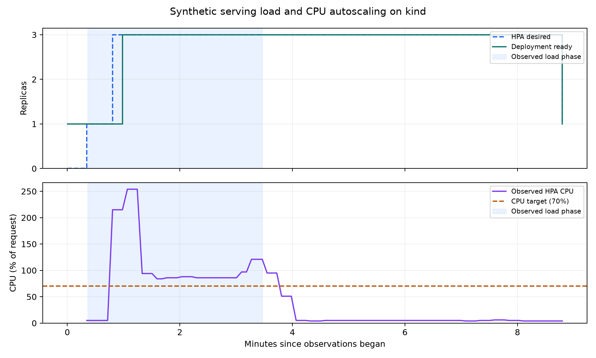

# In-cluster serving and CPU autoscaling — 2026-09-17

The isolated kind validation passed all workload and scaling gates. It sent 18,000 measured
requests at 100 requests/second through the Kubernetes Service, observed traffic on three serving
pods, and verified a return to one ready replica after traffic stopped.

## Measured result

| Measurement | Observed |
|---|---:|
| Scheduled requests / successful predictions | 18,000 / 18,000 |
| Measured load duration | 180 seconds |
| Successful throughput | 100 requests/second |
| P50 / P95 / P99 latency | 5.74 / 8.59 / 296.80 ms |
| P99 client dispatch delay | 170.94 ms |
| HTTP errors / dropped arrivals / static fallback | 0 / 0 / 0 |
| Broker-acknowledged predictions | 18,000 |
| Ready replicas before / during / after load | 1 / 3 / 1 |
| Successful predictions per pod, including warm-up and smoke | 8,270 / 4,815 / 4,936 |
| Serving pod restarts | 0 |
| Complete integration test, including setup and cleanup request | 603.96 seconds |

Latency starts at scheduled arrival and ends after response validation, including client dispatch
delay and connection setup. Twenty warm-up requests and one deployment smoke request are excluded
from the workload table but included in the per-pod counters. The P95 objective was below 50 ms;
P99 is reported to expose the tail, although this profile has no P99 acceptance gate. The exported
data does not isolate a single cause for the tail latency.

All seven combined checks passed: one ready baseline, CPU observations during load, requested
scale-up, additional ready capacity, successful traffic on multiple pods, return to one replica,
and the workload objectives. Three replicas were first observed ready approximately 37 seconds
after load observations began. The final one-replica state was observed approximately 320 seconds
after cooldown observations began. These are polling-resolution observations, not exact controller
decision times. The initial zero desired count in the chart precedes HPA metric initialization;
load starts only after a valid one-replica baseline.

## Configuration and boundaries

The environment was Kubernetes v1.35.0 on a shared, single-node ARM64 kind cluster with eight
reported CPUs and approximately 7.65 GiB of node memory. Existing Airflow, Redis, PostgreSQL,
Redpanda, and MinIO workloads shared the node. A temporary MLflow registry supplied a synthetic
native model; a dedicated Redis instance held seeded historical feature snapshots. Prediction
events used a unique topic in the existing broker.

The chart retained its defaults: a 100m CPU request, one-core limit, 70% CPU target, one to three
replicas, and a 300-second scale-down stabilization window. The client allowed 256 in-flight
requests with a two-second request timeout and opened a new connection for each request so new
replicas could receive traffic. Its CPU request/limit was 250m/one core. These settings are recorded
in the raw inputs and benchmark configuration.

This short synthetic run demonstrates the deployed inference, acknowledgment, Service-routing,
and CPU-autoscaling paths. It does not establish real-data accuracy, feature parity, sustained
production capacity, high availability, or request-rate scaling. Independent broker readback is
covered by the separate resilience suite; this run validates the acknowledgment contract.

## Reproduction and evidence

Follow the [load-test commands](../../README.md#in-cluster-load-and-cpu-autoscaling) using a new
output directory. The [machine-readable snapshot](kind-serving-load.json) records the workload
summary, scaling gates, image/input evidence manifest, and SHA-256 checksums. The figure and this
small snapshot are included in the repository; full request samples, model artifacts, Kubernetes
observations, and logs remain in the ignored local directory
`artifacts/benchmarks/kind-hpa-final/`. All 26 exported evidence-file checksums were verified after
the run. A new run produces its own complete evidence bundle.

Two earlier attempts are retained locally. `kind-hpa-20260917` exposed an uninitialized HPA
`currentMetrics: null` value in the collector; missing metrics are now handled and regression
tested. `kind-hpa-observed` passed the scaling checks but correctly failed the workload gate after
the original 32-request client cap dropped 78 arrivals. The final profile raised the client cap to
256 to cover 100 arrivals/second times the two-second timeout, with headroom. Offered load,
latency/error objectives, HPA settings, and the rule that any dropped arrival fails were unchanged.

The temporary namespace, Redis PVC, model registry, and broker topic are removed after validation.
Metrics Server remains installed as the local cluster prerequisite. See
[ADR-0013](../adr/0013-in-cluster-load-and-cpu-autoscaling.md) for the design decisions.
